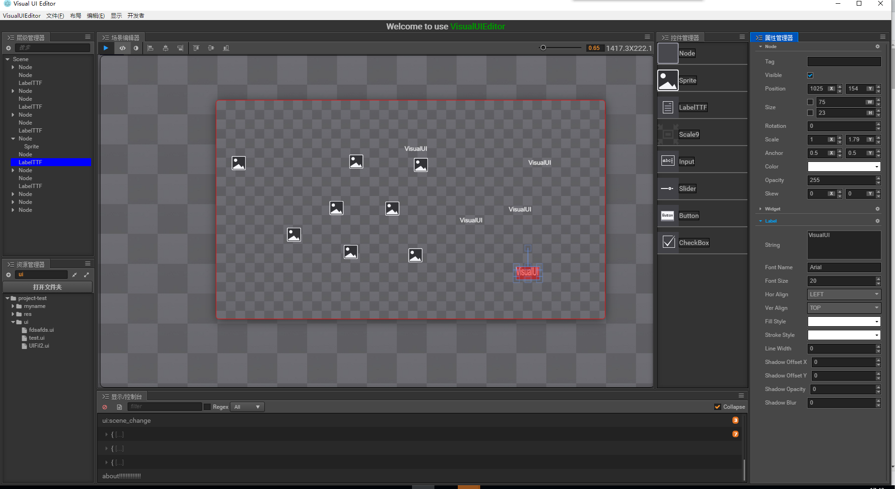

#VisualUIEditor

An UIEditor for Game, base on electron.

#install
> install node.js
> npm install fire-path
> npm install electron-prebuilt
> bower install

#run
open shell in project root and run
> electron .